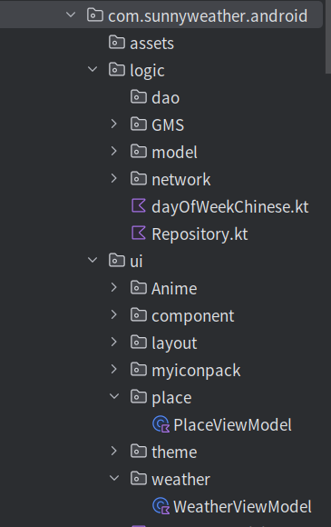
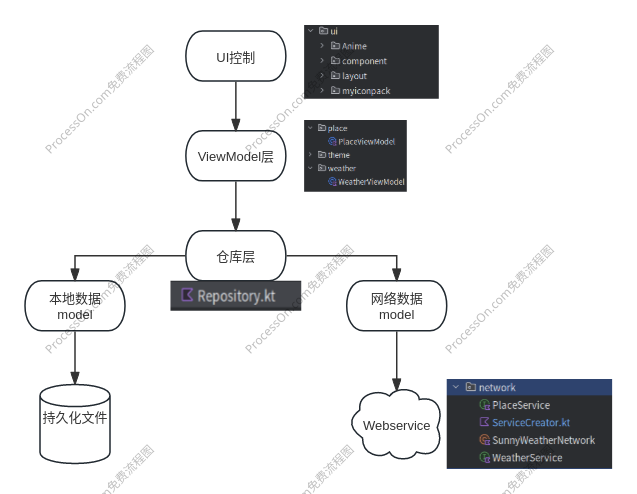

# Kotlin+MVVM+Compose+retrofit2+Flow+Jetpacks实现天气App(未完成)
## 前言 
纯新手，就想试试，顺便把一些框架的用法写下来

## 一，项目简介
项目采取kotlin编写，结合ViewModel,Navigation,flow等搭建MVVM架构

### MVVM项目框架
项目文件结构

MVVM架构可以将程序结构主要分层3部分：Model是数据模型部分;View是界面展示部分;而ViewModel可以理解成一个连接数据模型和界面展示的桥梁，从而实现让业务逻辑和界面展示分离的程序设计。
上图表示，UI控制层包含了Activity,Compose组件，布局文件等与界面相关的东西，ViewModel层用于持有和UI元素相关的数据，保证这些数据在屏幕旋转时不会丢失，并且还要提供接口给UI控制层以及和仓库层进行通信。
仓库层主要工作是判断调用方请求的数据应该是从本地数据源中获取还是从网络源中获取，并将获取的数据返回给调用方。本地数据源可以使用数据库，SharedPreferences等持久化技术来实现，而网络数据源则通常使用Retrofit访问服务器提供的Webservice接口来实现。
图中所有的箭头都是单向的，比如说UI控制层指向ViewModel层，表示UI控制层的引用，但反过来ViewModel层不能持有UI控制层的引用，其他几层也一样，引用也不能跨层持有，比如UI层不能有仓库层的引用。